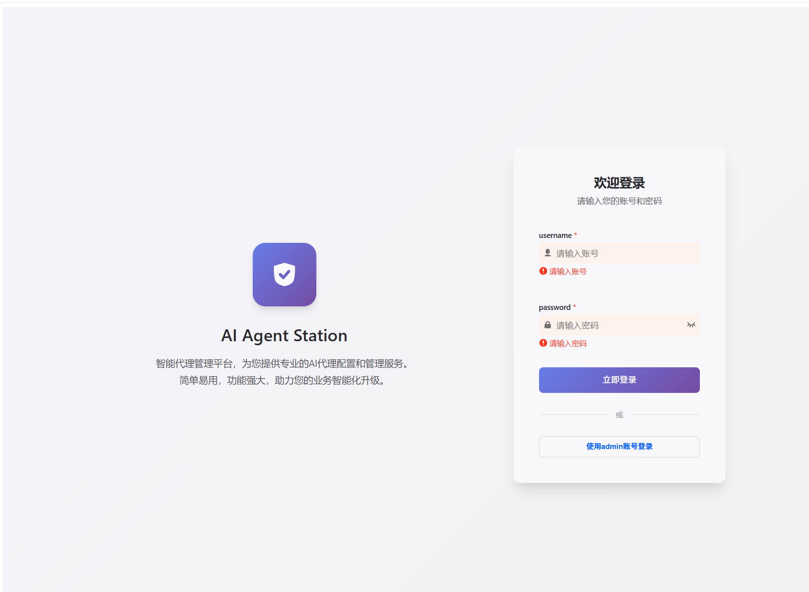
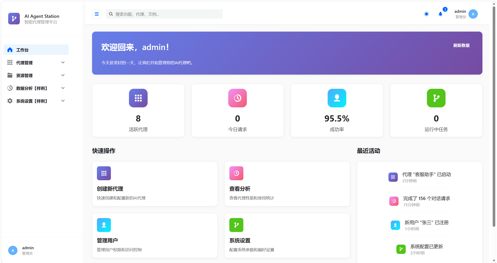
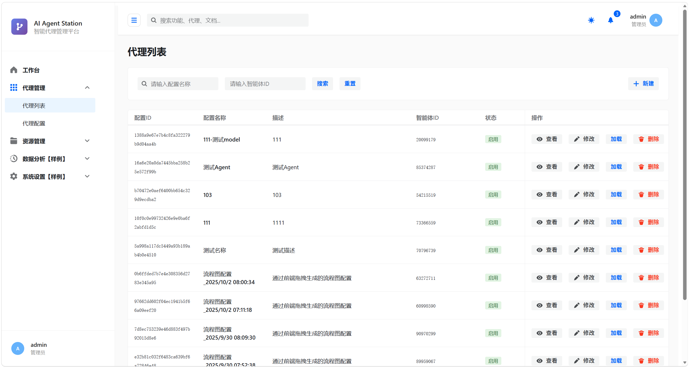
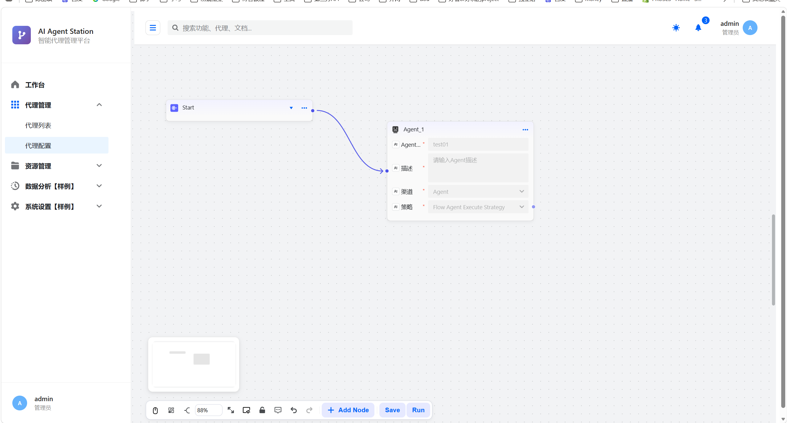
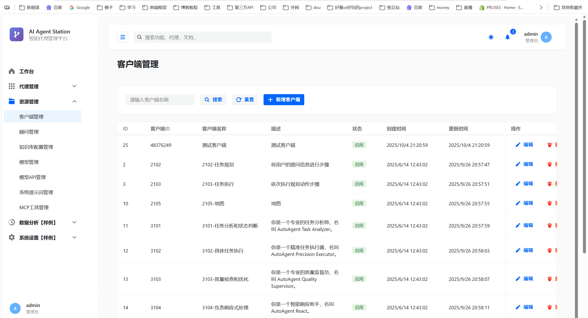

# AI Agent Station

> 智能代理管理平台，为您提供专业的 AI 代理配置和管理服务。  
> 简单易用，功能强大，助力您的业务智能化升级。

[](https://openjdk.org/)
[](https://spring.io/projects/spring-boot)
[](https://spring.io/projects/spring-ai)
[](LICENSE)



AI Agent Station 是一个面向多场景的 AI Agent 编排与执行平台。它以 Spring Boot 3.4 + Spring AI 1.0 为内核，基于 DDD 多模块架构，把"模型、客户端、顾问、知识库、Agent 流程图、定时任务"全部抽成可配置项，让运营同学在可视化界面拖拽出业务 Agent，并通过调度执行链路把 Agent 真正跑起来。

---

## ✨ 功能特性

### 🏠 工作台
仪表盘一眼看清系统健康度：活跃代理数、今日请求量、成功率、运行中任务。



### 🤖 代理管理
- **代理列表**：检索、启用 / 禁用、加载 / 卸载、查看 / 修改 / 删除
- **代理配置**：可视化拖拽编辑 Agent 流程图（Start / Agent / End 节点），配置 Agent 名称、描述、渠道与执行策略（Auto / Fixed / Flow Agent Execute Strategy）




### 🧰 资源管理
统一管理客户端、模型、模型 API、顾问、知识库配置、系统提示词、MCP 工具。




---

## 🛠 技术栈

| 层 | 技术 |
| --- | --- |
| 基础 | Java 17、Spring Boot 3.4.3、Maven 多模块 |
| AI | Spring AI 1.0（OpenAI 兼容）、MCP Client、pgvector 向量库 |
| 数据 | MySQL 8（业务库）、PostgreSQL 16 + pgvector（RAG 知识库） |
| ORM | MyBatis 3 |
| 调度 | wrench 自研任务调度 |
| 前端 | Vue3 + Vite（独立部署，路径 `docs/nginx/html`） |

---

## 📂 项目结构

```
ai-agent-station-study/
├── ai-agent-station-study-api/            # 接口层（DTO / 服务接口）
├── ai-agent-station-study-app/            # 应用层（启动类、配置、自动装配）
├── ai-agent-station-study-domain/         # 领域层（业务编排、执行策略）
├── ai-agent-station-study-infrastructure/ # 基础设施（DAO / 仓储 / 持久化）
├── ai-agent-station-study-trigger/        # 触发器层（HTTP 控制器、任务）
├── ai-agent-station-study-types/          # 通用类型（枚举、Job 模型）
├── docs/
│   ├── dev-ops/mysql/                     # MySQL 建表 SQL
│   ├── dev-ops/pgvector/                  # pgvector 初始化 SQL
│   ├── dev-ops/nginx/                     # Nginx 配置
│   └── screenshots/                       # README 截图
├── deploy/                                # 部署脚本（一键启动、systemd、Docker）
└── pom.xml                                # 父 POM
```

---

## 🚀 快速启动（本地开发）

### 环境要求
- **JDK 17+**
- **Maven 3.8+**
- **MySQL 8.0+**（业务库）
- **PostgreSQL 16+** + pgvector 扩展（RAG 知识库）

### 1. 准备数据库

```bash
# MySQL：导入业务库与初始化数据
mysql -uroot -p < docs/dev-ops/mysql/sql/ai-agent-station-study.sql

# PostgreSQL + pgvector：先建库 ai-rag-knowledge，再导入
psql -U postgres -c "CREATE DATABASE ai-rag-knowledge;"
psql -U postgres -d ai-rag-knowledge < docs/dev-ops/pgvector/sql/init.sql
```

### 2. 修改配置

编辑 `ai-agent-station-study-app/src/main/resources/application-dev.yml`：

```yaml
spring:
  datasource:
    mysql:
      username: root
      password: 你的MySQL密码
      url: jdbc:mysql://127.0.0.1:3306/ai-agent-station-study?...
    pgvector:
      username: postgres
      password: 你的PG密码
      url: jdbc:postgresql://127.0.0.1:15432/ai-rag-knowledge
  ai:
    openai:
      base-url: https://你的AI网关
      api-key: 你的KEY
```

### 3. 启动后端

```bash
# 方式 A：IDE 直接跑 cn.bugstack.ai.Application
# 方式 B：命令行
mvn -pl ai-agent-station-study-app spring-boot:run -Pdev
```

启动成功后访问 `http://127.0.0.1:8091/`，看到登录页即表示后端跑通。

---

## 🐳 一键部署（Docker Compose）

Docker Compose 把 MySQL、PostgreSQL/pgvector、后端、Nginx 编排到一起，零依赖启动：

```bash
# 1. 打包后端
mvn clean package -DskipTests -Pprod

# 2. 把 jar 拷成 app.jar
cp ai-agent-station-study-app/target/ai-agent-station-study-app-1.0-SNAPSHOT.jar \
   deploy/docker/app.jar

# 3. 启动
cd deploy/docker
cp .env.example .env       # 按需修改密码 / API Key
docker compose up -d
```

启动后访问 `http://服务器IP`（80 端口 → Nginx 反代到 8091）。

---

## 🖥 传统部署（裸机 / 虚拟机）

### 服务器要求
- **2C4G 起**，公网带宽 ≥ 5 Mbps
- **JDK 17+**、MySQL 8、PostgreSQL 16 + pgvector

### 部署步骤

```bash
# 1. 上传文件到 /opt/ai-agent
mkdir -p /opt/ai-agent/{app,logs,config}
#   app.jar                                   -> /opt/ai-agent/app/
#   deploy/*.sh                               -> /opt/ai-agent/
#   deploy/config/application-prod.yml        -> /opt/ai-agent/config/

# 2. 安装为系统服务（开机自启、异常自动拉起）
chmod +x /opt/ai-agent/*.sh
sudo bash /opt/ai-agent/install-systemd.sh

# 3. 日常运维
/opt/ai-agent/start.sh      # 启动
/opt/ai-agent/stop.sh       # 停止
/opt/ai-agent/restart.sh    # 重启
/opt/ai-agent/logs.sh       # 实时日志
systemctl status ai-agent   # 服务状态
```

打开 `http://服务器IP:8091/` 即可访问。  
**加 Nginx 反代走 80/443 端口**：把 `deploy/nginx/ai-agent.conf` 放到 `/etc/nginx/conf.d/`，然后 `nginx -t && nginx -s reload`。

---

## 📜 端口清单

| 端口 | 用途 |
| --- | --- |
| **8091** | Spring Boot 后端 |
| 3306 | MySQL |
| 15432 | PostgreSQL（容器端口；宿主默认 5432） |
| 80 / 443 | Nginx 反代（推荐） |
